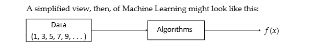
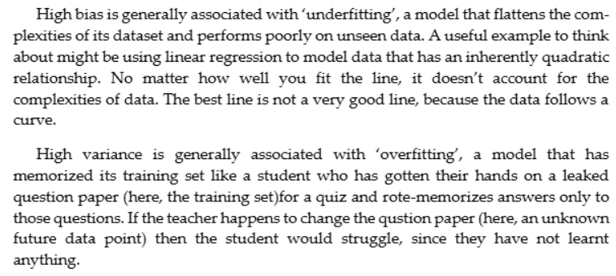
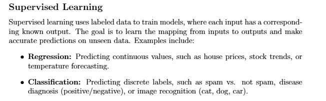
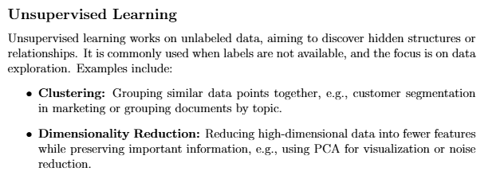
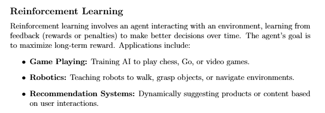
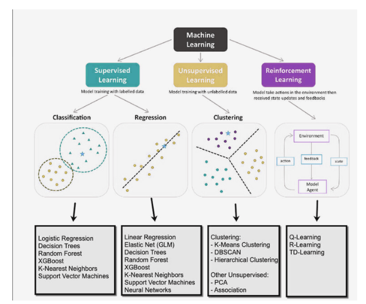

# Machine learning basic:

## Bias, Variance, Overfitting, Underfitting:
-   A model that makes strong assumptions about training data to simplify the learning process or one that doesn't have ability to factor in
certain complexities is said to have high bias
-   On the other hand a model that becomes so attached to the dataset that it finds it difficult to generalize and had learnt the idiosyncracies and noise
of the data rather than the underlying pattern is said to have high variance

## Types of Machine learning
1) Supervised learning:  

      

2) Unsupervised learning:  
  

3) Reinforcement learning:  
      

4) Modern topics in ML
-   Semi-supervised learning
-   Self-supervised learning
-   Online/Streaming ML:
-   AutoML and Hyper parameter optimization

### Overview
